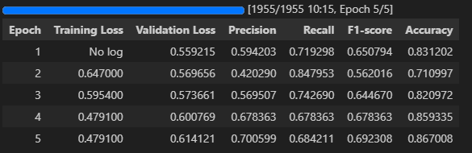
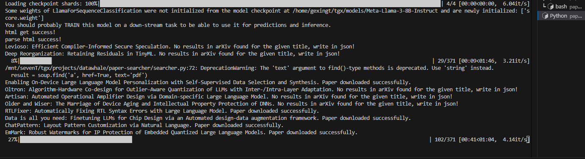
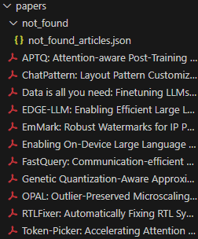

# paper-searcher
**paper-searcher**是一个辅助论文搜索下载的大模型应用，它能够去自动搜索**dblp**网站(目前仅支持dblp网站论文搜索)，并能够找到其中与大模型相关的论文标题，然后自动去arxiv(目前仅支持arxiv的搜索)上进行下载，若未在arxiv上找到，会生成一个论文清单记录未在arxiv上找到的论文标题，后续用户可以去搜索下载
> dblp（Digital Bibliography & Library Project）是一个计算机科学领域的文献数据库和搜索引擎。它提供了计算机科学领域的学术论文、会议论文、期刊文章等文献的详细信息，包括作者、标题、出版年份、出版物、引用等。dblp 旨在为研究人员、学生和学术界提供一个方便的工具来查找和管理计算机科学领域的学术资源。例如人工智能顶会NeurIPS，[*link*](https://dblp.org/db/conf/nips/neurips2023.html), 录用论文均能在此网站上查询到

## 一、环境准备

基础环境
```
Ubuntu 18.04.6 LTS
python 3.10
cuda 11.8
pytorch 2.4.0
```
依赖包
```
beautifulsoup4==4.12.3
datasets==2.21.0
evaluate==0.4.2
numpy==2.2.0
pandas==2.2.3
peft==0.13.2
Requests==2.32.3
sparkai==0.3.0
torch==2.4.0
tqdm==4.66.4
transformers==4.46.1
websocket_client==1.8.0
```
## 二、数据准备以及模型微调
基本思路是通过**星火大模型API**去标注数据，然后利用该数据对**较小**的模型**LLaMa3**进行**Lora微调**，然后使用微调后的小模型去判断哪些论文与大模型相关  
具体可查看文件[finetune.ipynb](./finetune.ipynb), 也可参考[Lora-for-sequence-classification-with-Roberta-Llama-Mistral.md](https://github.com/huggingface/blog/blob/main/Lora-for-sequence-classification-with-Roberta-Llama-Mistral.md)  
微调后的得分指标如下:  

可以看到在第5个Epoch后Acc达到最高
## 三、如何使用
配置`config.json` 文件, 填入模型文件地址，lora微调后的模型文件地址，需要搜寻下载论文的网页(**当前仅支持dblp**)
```
{
    "model_path": "/home/gexingt/tgx/models/Meta-Llama-3-8B-Instruct",
    "lora_path": "/home/gexingt/tgx/projects/datawhale/paper-searcher/llama-lora-token-classification/checkpoint-1955",
    "paper_web_url": "https://dblp.org/db/conf/dac/dac2024.html"
}
```
直接运行
```
python searcher.py
```
运行时截图:

此时**searcher**会自动下载与大模型相关的论文，并将其存放在`papers`文件夹中
